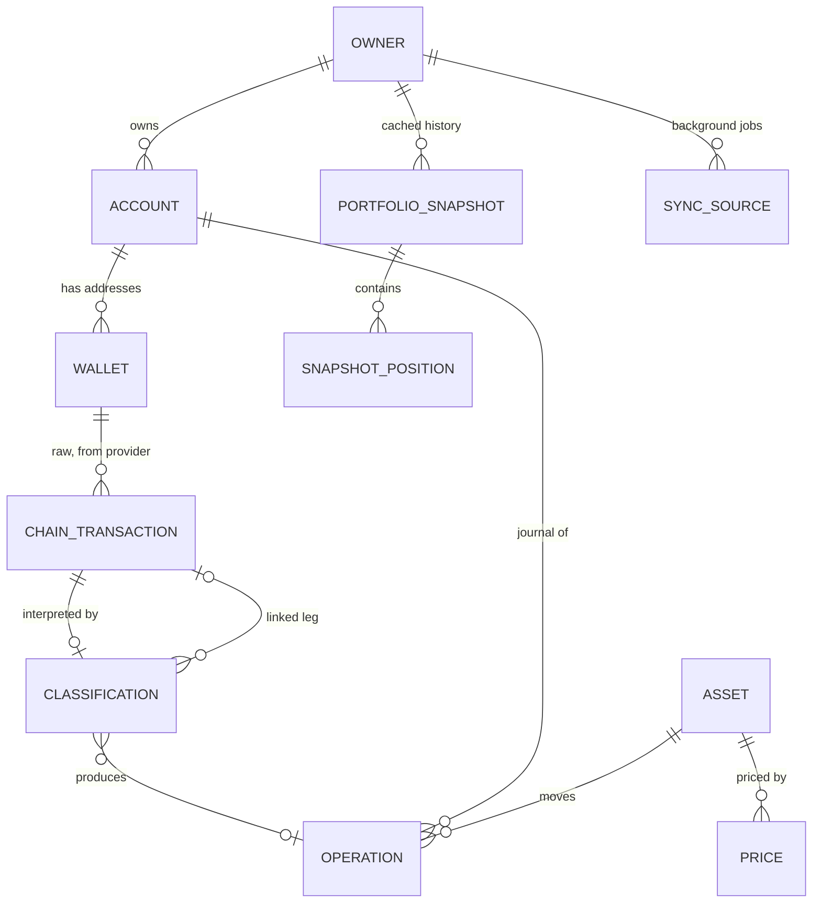
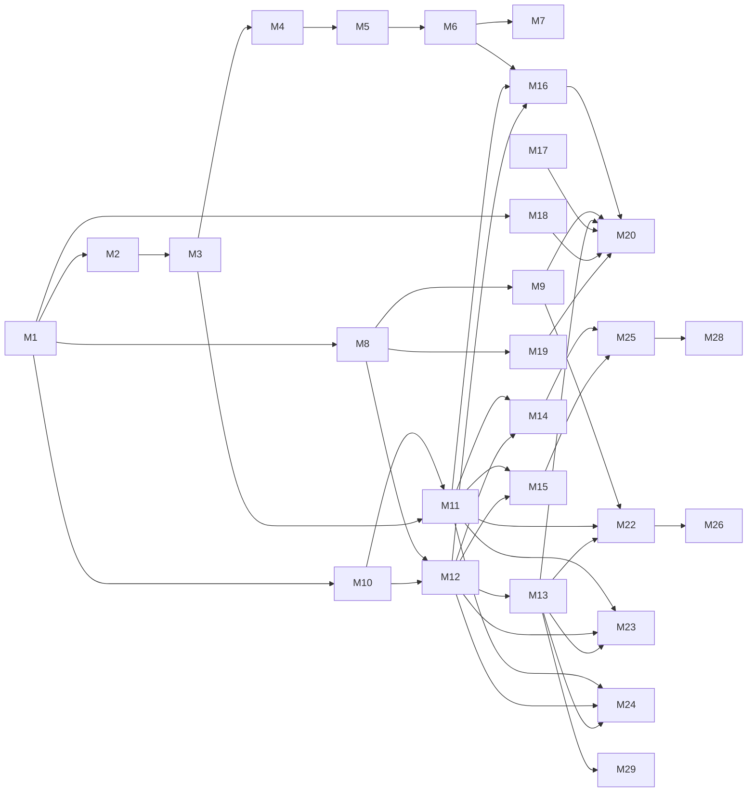

# Personal Capital Tracker — Product Requirements

Status: proposal for owner review, 2026-10-04. Source: the owner's
[business requirements](business-requirements.md) (BR). This document turns them into
product requirements, epics, user stories with acceptance criteria, an entity model,
a gap analysis against the current code and an ordered list of small OpenSpec changes.
It does not change behaviour; every item below still goes through the repository's
OpenSpec propose → acceptance RED → implement → review → verify → archive sequence.

Updated 2026-10-04 after the owner accepted the clickable prototype from the design
thread: English interface, one-month default period, and the money rules from its
"Structure & flows" tab, section "How the numbers work"
([prototype](https://claude.ai/artifact/PfuvS6Hn6Jep69TJLANmaR)). Those rules are
folded into sections 2, 3 and 5 below.

Contents:

1. [Owner answers and decisions](#1-owner-answers-and-decisions)
2. [Principles](#2-principles)
3. [Product requirements](#3-product-requirements)
4. [Entity model](#4-entity-model)
5. [Epics, user stories and acceptance criteria](#5-epics-user-stories-and-acceptance-criteria)
6. [ATDD and E2E plan](#6-atdd-and-e2e-plan)
7. [Gap analysis](#7-gap-analysis)
8. [OpenSpec change order](#8-openspec-change-order)
9. [What happens to the current screens](#9-what-happens-to-the-current-screens)
10. [Later versions](#10-later-versions)

## 1. Owner answers and decisions

Pavel answered the ten open questions on 2026-10-04. The plan below follows them.

| # | Question | Answer | Affects |
|---|---|---|---|
| Q1 | Accounting currency | **Three currencies, USD, EUR and RUB, with room to add more.** Cost basis and P&L are computed in each, using the FX rate on each operation's date (see "Three accounting currencies" in section 2). | M5 |
| Q2 | Realized P&L method | **FIFO**, as today; average buy price is shown, not used for realization. | M4 |
| Q3 | Crypto price source | **Both Kraken (public API, no key) and CoinGecko (free Demo API key), alternating**; when one fails the other is used. Every observation records its source. CoinGecko's Demo terms limit long-term storage and its history reaches back only 365 days ([provider feasibility](provider-feasibility.md)), so the backfill to 01.01.2025 uses Kraken's daily candles (to verify in M3). | M3 |
| Q4 | Chart backfill | **Once, from 01.01.2025**, from daily historical prices. | M6 |
| Q5 | Password-reset mailbox | **Yandex** (SMTP `smtp.yandex.ru`, port 465, app password kept as a server secret). | M17 |
| Q6 | Free Etherscan key for Ethereum history | **Yes.** | M14 |
| Q7 | Tokens in MVP | **Only USDT and USDC** (ERC-20 and SPL). | M14, M15 |
| Q8 | Trezor xpub in MVP | **No, right after MVP.** | M21 |
| Q9 | Purchase paid with outside money is a deposit | **Yes.** | M7 |
| Q10 | Hide XIRR, TWR and "period profit" in the new interface | **Yes**; code stays until a separate removal. | M20 |

Decisions taken without asking, open to correction:

- **D1 Unclassified chain movements count provisionally.** An unclassified incoming
  transaction adds its quantity with unknown cost; an unclassified outgoing one
  removes quantity. Balances and portfolio value therefore match the chain before
  classification, P&L shows "cost unknown" for that part, and nothing becomes a
  deposit or a withdrawal until classified.
- **D2 A wallet belongs to an account.** Accounts are where assets are held (Trust
  Wallet, Trezor, Bybit, Cash). A wallet address is attached to one account; an
  account can have several addresses and may have none (exchange, cash).
- **D3 "Delete" means void.** Every journal already keeps immutable versions;
  deleting a manual operation adds a void version, which is also the audit trail
  (BR 14). Chain transactions can only be hidden, never deleted (BR 9).
- **D4 Zcash, TRON and Stellar stay manual assets in MVP** (BR 17 lists only BTC,
  ETH and SOL wallets).
- **D5 Browser TOTP enrollment stays CLI-only in MVP.** The owner is already enrolled;
  Settings adds recovery-code regeneration, active sessions and "log out everywhere".
  Re-enrolment from the browser is a later item.
- **D6 Interface language is English** (owner, 2026-10-04, design thread). The
  dashboard's default period is one month. The current Russian screens stay as they
  are until they are retired.
- **D7 Transfers between known own wallets are automatic** (owner, 2026-10-04). When
  both sides of a transaction are wallets or accounts the owner registered, it is
  classified as Transfer without asking; the owner can still reclassify it.
- **D8 Bybit is the one exchange exception** (owner, 2026-10-04) to "exchange API
  integrations" being out of scope (BR 18). Bybit's V5 API is free with a read-only
  key and returns balances, spot trades, deposits, withdrawals and a transaction log
  covering up to two years. Whether the two RUB purchases (likely P2P) are visible
  is unverified: Bybit's P2P API is documented as a separate API. Anything the API
  cannot return stays manual. Change M22 verifies this against Pavel's own read-only key.

## 2. Principles

1. **Operations are the source of truth.** Quantities, cost basis, balances, P&L and
   portfolio value are computed from operations and stored prices. No stored
   "current balance" is authoritative. A chain balance is fetched only to reconcile
   and to raise a mismatch warning.
2. **Raw data and interpretation are separate.** A chain transaction is stored as
   received from the provider and never edited. The owner's classification, cost,
   comment and links live in separate versioned rows, so a resync cannot overwrite them.
3. **Snapshots are a cache.** `PortfolioSnapshot` rows make charts fast. When an
   operation dated in the past is added, changed or voided, snapshots from that
   instant on are rebuilt from operations and stored prices without calling providers.
4. **Database first.** Prices, FX rates and chain data are stored when fetched. When
   a provider is down, the app shows the last stored data and says how old it is.
5. **Missing is not zero.** A missing price, unknown cost or incomplete history shows
   as missing; totals that depend on it are marked incomplete, never silently low.
6. **Exact money.** Decimal strings and PostgreSQL `numeric`, as today. Every operation
   keeps its value in the currency it was paid in; USD, EUR and RUB amounts are
   derived from stored FX rates (Q1). Rounding happens only for display.
7. **Small additive steps.** Every change is additive on the existing schema and data.
   Destructive schema changes need an export, a migration plan and the owner's approval.

### Three accounting currencies (Q1)

USD, EUR and RUB are all accounting currencies; more can be added later by adding
their FX series, without schema changes.

- **Rates.** Daily official rates of the Bank of Russia (cbr.ru, free, history back
  decades) give USD/RUB and EUR/RUB; EUR/USD is derived from them. The owner already
  uses Bank of Russia rates for RUB purchases. Rates are stored like prices
  (principle 4); on days without a published rate the latest earlier rate applies.
- **Cost basis per currency.** Each acquisition's cost is converted into every
  accounting currency at its own date's rate and kept per lot. A purchase paid in
  RUB keeps its exact RUB cost; its USD and EUR cost come from that day's rates.
- **P&L per currency.** Realized P&L = proceeds at the sale date's rate − FIFO cost in
  that currency. Unrealized P&L = current value at today's rate − remaining cost in
  that currency. RUB P&L therefore includes the ruble's movement against the dollar,
  which is the point of keeping it separately.
- **Flows per currency.** Deposits and withdrawals are valued at their date's rate in
  each currency, so the market/flow split below holds in every currency.
- **Display.** Settings picks the main currency; screens show it and can switch to
  the other two.

### Capital change: market versus flows (BR 10)

For a period from `t0` to `t1` with portfolio values `V0` and `V1`:

- `netFlow` = deposits − withdrawals in the period, each valued in USD at its instant.
- `marketEffect` = `V1 − V0 − netFlow`.
- `marketReturn %` = `marketEffect / (V0 + deposits)`, empty when the denominator is 0.
  For "all time" (`V0 = 0`) this equals the spreadsheet's "Доход" column.

What counts as a flow (Q9):

| Operation | Flow |
|---|---|
| Buy | spends the account's cash in the paid currency first (no flow); only the part paid with money from outside the app is a deposit |
| Sell | none; proceeds (USDT, RUB, USD…) stay in the same account as cash |
| Explicit withdrawal of cash from an account | withdrawal |
| Income, Gift received | deposit at USD value on receipt |
| Expense, Gift sent | withdrawal at USD value on disposal |
| Reward, Staking reward, Airdrop | none (part of return) |
| Fee | none (reduces return) |
| Transfer between own accounts | none; its fee is a Fee |
| Explicit deposit / withdrawal (existing external USD flows) | as declared |
| Unclassified (D1) | none until classified |

### Cash and available balance (accepted prototype)

- **Sale proceeds stay as cash.** A Sell adds its proceeds, net of fee, to the same
  account as a cash position in the proceeds currency. Net worth changes only by the
  difference between sale price and current price; realized P&L = proceeds − cost
  basis of the sold quantity.
- **A Buy spends cash first.** If the account holds cash in the paid currency, the
  Buy uses it; only the remainder is new money from outside (a deposit).
- **No overspending.** A Sell, Expense or Transfer cannot exceed the quantity available
  in that account on its date, where available = the lowest balance of that asset
  from that date forward. A backdated operation therefore cannot break a later sale.
  The form shows the available amount and a "Use all" button.
- **No orphaned sales.** A Buy whose lots a later Sell, Expense or Transfer consumed
  cannot be deleted; the app names the dependent operation.

## 3. Product requirements

IDs are stable; each names its BR section and MVP item (BR 17 numbering).

| ID | Requirement | BR | MVP |
|---|---|---|---|
| PR-UI-1 | The new interface is in English; numbers, dates and currencies follow the formats in the design brief. | — | 5 |
| PR-AUTH-1 | One owner, created only by the CLI; no signup route. | 2.1 | 1 |
| PR-AUTH-2 | Sign-in needs email, password and a TOTP code or a single-use recovery code. | 2.1, 2.3 | 2, 4 |
| PR-AUTH-3 | Password reset by an emailed single-use link that expires after 30 minutes; success revokes every session and still requires TOTP. The request answer is identical for known and unknown emails. | 2.2 | 3 |
| PR-AUTH-4 | Settings can regenerate recovery codes (after a TOTP check), list active sessions and log out everywhere. | 2.3 | 4 |
| PR-AST-1 | An asset has type (crypto, fiat, manual), name, ticker, valuation currency and price source; new types can be added without schema rewrites. | 4 | 12 |
| PR-AST-2 | A manual asset's value can be updated by hand at any time; each update is kept. | 4, 8 | 12 |
| PR-PRC-1 | Crypto prices are collected at least hourly from Kraken and CoinGecko in turn, behind a provider interface; when one fails the other is used (Q3). | 5.1, 5.2 | 10 |
| PR-PRC-2 | Every observation stores asset, price, quote currency, timestamp, source and fetch time, and is never deleted. | 5.3, 16 | 11 |
| PR-PRC-3 | A price older than 2 hours is shown as stale; an asset with no price is "no price", not 0. | 5, 16 | 10, 25 |
| PR-WAL-1 | The owner adds a read-only public address for Bitcoin, Ethereum or Solana, with an optional name, to an account. Keys and seed phrases are never asked for or stored. | 6 | 14–16 |
| PR-WAL-2 | Each wallet syncs its transactions (time, asset, amount, hash, fee, sender, recipient) and balance in the background, incrementally. | 6, 12 | 14–17, 24 |
| PR-WAL-3 | A chain transaction is unique per network and transaction identity (hash, plus log or instruction index where one hash moves several assets). Resync never duplicates it. | 13 | 17 |
| PR-WAL-4 | When the computed balance differs from the chain balance, the wallet and dashboard show a mismatch. | 6, 16 | 25 |
| PR-EXC-1 | The Bybit account syncs read-only through Bybit's free V5 API (D8): balances, spot trades as Buy/Sell with their real prices and fees, deposits and withdrawals. The API key is read-only, bound to the server's IP and stored encrypted; it is never shown again after saving. | 18 (exception) | 17, 24 |
| PR-OPS-1 | All asset changes are visible as one operation list regardless of source (manual, CSV, chain), with type, date, asset, amount, value, account, status and source. | 7 | 13, 17 |
| PR-OPS-2 | Operation types: Buy, Sell, Transfer between own accounts, Income, Expense, Fee, Reward, Staking reward, Airdrop, Gift, Other. | 7.1 | 18 |
| PR-OPS-3 | New chain transactions are "Needs classification"; the dashboard shows how many. | 7.2 | 18 |
| PR-OPS-4 | The owner creates, edits and deletes manual operations with date (time optional), type, asset, quantity, amount, currency, fee, account and comment; required fields depend on type. | 8 | 13, 20 |
| PR-OPS-5 | For a chain transaction the owner can set classification, comment, cost or proceeds, linked transaction, or hide it from calculations. Raw data is never edited. | 9 | 18 |
| PR-OPS-6 | Outgoing and incoming legs between known own wallets or accounts are classified as one transfer automatically (D7); other legs can be linked by hand; a transfer changes capital only by its fee. | 7.1 | 19, 20 |
| PR-OPS-7 | Every create, correction, classification and void is kept as an immutable version with its time and source. | 14 | — |
| PR-OPS-8 | A Sell, Expense or Transfer cannot exceed the available quantity (lowest balance from its date forward); the form shows it and offers "Use all". A Buy that later operations consume cannot be deleted. | 7, 8 | 13 |
| PR-OPS-9 | Sale proceeds stay in the account as cash; a Buy spends that cash before counting outside money as a deposit. | 10, 11 | 13, 22 |
| PR-VAL-1 | Portfolio value now, in the selected main currency (USD, EUR, RUB), over all accounts. | 3.1 | 5, 6, 9 |
| PR-VAL-4 | Cost basis, realized and unrealized P&L are kept in USD, EUR and RUB, each with the FX rate of the operation's date; adding another currency needs only its rate series (Q1). | 3.1, 11 | 9, 21, 22 |
| PR-FX-1 | Daily Bank of Russia rates for USD and EUR are collected and stored with their date and source, backfilled from 01.01.2009, so carry-in lots and other operations older than the 2025 chart history have the rate of their own date. | 5.3, 16 | 9, 11 |
| PR-VAL-2 | Per asset: quantity, price, value, allocation, average buy price, cost basis, unrealized and realized P&L. | 11 | 21, 22 |
| PR-VAL-3 | Allocation by asset, asset type and account. | 3.3 | 8 |
| PR-HIS-1 | An hourly portfolio snapshot is stored; backdated operation changes rebuild later snapshots. | 3.2, 12 | 7, 24 |
| PR-HIS-2 | Chart periods 24H, 7D, 1M, 3M, 1Y, ALL (default 1M), with absolute and percentage change for the period. | 3.1, 3.2 | 7 |
| PR-HIS-3 | For any period, the change splits into market effect and net deposits/withdrawals. | 10 | 7 |
| PR-SYN-1 | Each background source (prices, FX, each wallet) has its own state: last success, last attempt, state (synced, syncing, delayed, failed) and a readable error. One failing source never blocks another. | 12 | 24, 25 |
| PR-EXP-1 | Export CSV (assets, accounts and wallets, operations with classifications) and a JSON backup. | 15 | 23 |
| PR-OWN-1 | With every provider down, history, operations, last prices and allocation stay available. | 16 | — |

## 4. Entity model

Names in the first column are the product entities from BR; the second column says
where each lives today and what changes. All changes are additive.

### Asset

Today: `accounting_instruments` (name, symbol, `namespace = 'manual'`).

| Field | Type | Notes |
|---|---|---|
| id | uuid | existing |
| name, ticker | text | existing `name`, `symbol` |
| assetType | enum: crypto, fiat, manual | new; existing rows default to crypto when the ticker is a known crypto ticker, else manual |
| network, contract | text, nullable | new; e.g. `ethereum` + ERC-20 contract; native coins have no contract |
| decimals | int, nullable | new; chain precision for display |
| valuationCurrency | USD, EUR, RUB | new; USD for crypto, own currency for fiat |
| priceSource | provider key, `manual` or `fixed` | new; `fixed` for USD (1) and pegged stablecoins only when the owner chooses it |
| providerRef | text, nullable | new; e.g. Kraken pair |

Quantity and current value are computed, not stored (principle 1).

### Account and Wallet

Account today: `manual_accounts` plus one journal per account (trades, openings,
carry-in, transfers, swaps, rewards). Wallet today: `wallet_addresses` (Bitcoin only,
not bound to an account).

| Entity | Field | Notes |
|---|---|---|
| Account | id, name | existing |
| Account | kind: wallet, exchange, cash, other | new, default other |
| Wallet | id, network, address | existing; network check widens to ethereum, solana |
| Wallet | accountId | new, nullable for existing rows until the owner picks one |
| Wallet | label | new, optional ("Ledger BTC") |
| Wallet | sync cursors | existing per network (Bitcoin walk cursors); others add their own |
| Wallet | chainBalance, chainBalanceAt | new; latest fetched balance per asset, for reconciliation only |

### ChainTransaction (raw)

Today: `wallet_address_transactions` (per address and txid, received/sent/fee units,
direction, raw provider JSON). Kept unchanged in meaning; new networks add rows with:

| Field | Notes |
|---|---|
| network, address, txHash | existing (txid) |
| leg | new, default 0: log index (ERC-20) or instruction index (SPL) when one hash moves several assets |
| assetId | new; native coin or token |
| blockTime, blockHeight, status | existing |
| received, sent, fee (base units) | existing |
| from, to | new; parsed counterparties (array for UTXO chains) |
| raw | existing; provider payload as received |

Uniqueness: `(addressId, txHash, leg)`. Never updated after insert, never deleted.

### Classification (new)

The owner's interpretation of one chain transaction leg. Versioned like every journal.

| Field | Notes |
|---|---|
| chainTransactionRef | address, txHash, leg |
| status | unclassified (implicit when no row), classified, hidden |
| type | one of PR-OPS-2 |
| operationRef | journal row it produced (trade, transfer, reward, …), nullable for hidden |
| linkedChainTransactionRef | other leg of an own transfer |
| comment | text |
| version, kind (create, correct, void), createdAt | audit |

PR #36 adds `wallet_address_trade_links` (incoming BTC completed as a buy); M12
generalizes it into this entity and migrates its rows additively.

### Operation (unified view)

Today operations are spread across journals: `account_trade_versions` (buy, sell),
`owned_transfer_versions`, `account_swap_versions`, `account_reward_versions`,
`account_opening_positions`, `account_carry_in_lots` and `portfolio_flow_versions`
(external USD flows). The plan keeps these tables, because their FIFO and
correction rules are tested, and adds one read model over them:

| Field | Notes |
|---|---|
| id | immutable id of the journal row (BR 13) |
| type | PR-OPS-2, derived from the journal kind and classification |
| occurredAt | date; time optional (PR #35) |
| accountId, assetId, quantity | |
| paidAmount, paidCurrency, rate | PR #34 adds paid currency and rate |
| value and cost in USD, EUR, RUB | derived from Bank of Russia rates of the operation's date (Q1) |
| fee, feeAsset | fee in USD or in the native asset (network fee) |
| counterAssetId, counterQuantity | swap and own transfer legs |
| comment | new column on journal versions |
| source | manual, csv, chain |
| status | active, voided, provisional (D1) |
| flowEffect | deposit, withdrawal or none (section 2) |
| version | current version number |

New journal kinds needed: Income, Expense, Gift, Fee and Other where no existing
journal fits. The current USD trade journal does not hold the paid or received money
as a position; PR-OPS-9 needs a cash position per account and currency, written by
Buys and Sells from M9 on (existing trades keep their meaning: paid from outside). Rewards, Staking rewards and Airdrops map to the existing reward journal.

### Price and FX

| Entity | Today | Change |
|---|---|---|
| Manual price | `manual_usd_price_versions` | keep |
| Price observation | none (legacy `crypto-prices.service` keeps CoinGecko prices in memory only) | new `price_observations`: assetId, price, quoteCurrency, observedAt, source, fetchedAt; unique per asset, source, observedAt |
| FX rate | `display_fx_observations` (daily USD→EUR, RUB from open.er-api.com, opt-in, current day only, display only) | new `fx_rates`: currency, rate per RUB, date, source (Bank of Russia), fetchedAt; daily job and one backfill from 01.01.2009. The open.er-api.com display panel is retired with the old Settings screen |

Valuation rule: for asset A at instant t, use the latest automatic observation at or
before t when A's source is a provider, else the latest manual price at or before t.
Older than 2 hours (provider) is "stale"; none at all is "no price".

### PortfolioSnapshot (new)

| Field | Notes |
|---|---|
| takenAt | hourly; backfilled rows are daily from 01.01.2025 (Q4) |
| valueUsd | sum of priced positions |
| complete | false when any held asset has no price |
| netFlowUsd | deposits − withdrawals since the previous snapshot |
| snapshot positions | assetId, accountId, quantity, priceUsd, valueUsd, costUsd |
| computedAt, inputsRevision | to detect and rebuild stale rows |

Snapshot values and flows are stored in USD, EUR and RUB, each converted with the
rate valid at `takenAt`, so the chart in any currency needs no recomputation.

### SyncSource (new)

| Field | Notes |
|---|---|
| key | `prices:kraken`, `fx:open-er-api`, `wallet:<id>` |
| state | synced, syncing, delayed, failed |
| lastAttemptAt, lastSuccessAt | |
| errorCode, errorMessage | human-readable, no secrets |
| nextRunAt | |

The existing display-FX collector already persists reservations and freshness; its
state is exposed through this entity instead of a separate one.

### Owner, sessions, MFA

Existing: `users`, `owner_auth`, `auth_sessions`, `owner_mfa`, `owner_mfa_recovery`,
`auth_request_limits`. New: `password_reset_tokens` (hashed token, expiresAt,
usedAt) and `owner_settings` (base currency, theme).

## 5. Epics, user stories and acceptance criteria

Acceptance criteria are written so they can become OpenSpec scenarios without
rewording: the ID becomes the scenario ID. "E2E" marks criteria that need a
Playwright journey through the real backend and PostgreSQL; the rest are API or
integration level (Jest against real PostgreSQL where the database matters).

Numbers reused across criteria come from BR 11 and from the owner's spreadsheet
(first row: 13.06.2025, 0.00918359 BTC for 1000 USDT).

### E1 Access and security

**US-1.1** As the owner I sign in with email, password and a TOTP code so only I can
see my capital. (Existing; kept as regression.)

- AUTH-LOGIN-OK (E2E): **Given** an enrolled owner **when** they submit the correct
  email and password **then** they are asked for a code, **and when** they enter a
  valid TOTP **then** they land on the dashboard.
- AUTH-LOGIN-BAD-CODE: **Given** a pending password step **when** a wrong code is sent
  **then** access is refused with "Invalid code" and the attempt counts against the limit.
- AUTH-NO-SIGNUP: **Given** any visitor **when** they look for a registration page or
  call a signup route **then** none exists.

**US-1.2** As the owner who forgot the password I reset it by email.

- RESET-REQUEST (E2E): **Given** the owner's email **when** "Forgot password" is
  submitted **then** the page says "Check your email" **and** one email with a link
  arrives; **given** an unknown email **then** the page and response are identical and
  no email is sent.
- RESET-USE (E2E): **Given** a valid link and an open session in another browser
  **when** a new password is set **then** the other session is logged out, the old
  password no longer works, **and** the new password still requires TOTP.
- RESET-EXPIRED: **Given** a link older than 30 minutes **when** it is opened **then**
  the page says it expired and offers a new one; the password is unchanged.
- RESET-REUSE: **Given** a link already used **when** it is opened again **then** it is
  refused.
- RESET-LIMIT: **Given** many reset requests from one client **when** the request
  limit is reached **then** further requests are refused without sending email.

**US-1.3** As the owner I manage my second factor and sessions in Settings.

- SEC-CODES: **Given** a signed-in owner **when** they regenerate recovery codes and
  confirm with a TOTP **then** ten new codes are shown once and the old codes stop working.
- SEC-SESSIONS: **Given** sessions in two browsers **when** the owner chooses "log out
  everywhere" **then** both sessions end and the current browser returns to login.

### E2 Assets and prices

**US-2.1** As the owner I see each asset with its type, ticker and price source so
I know where its value comes from.

- AST-TYPES: **Given** existing instruments BTC, ETH and "Cash USD" **when** the
  migration runs **then** BTC and ETH are crypto with a provider source, the cash is
  manual, and no trade, lot or P&L value changes.
- AST-NEW: **Given** the asset form **when** the owner adds "Deposit" of type manual in
  RUB **then** it appears with source "manual" and "no price" until a value is entered.

**US-2.2** As the owner I get prices automatically every hour.

- PRC-HOURLY: **Given** BTC with provider source and a stubbed provider returning
  84945 USD **when** the hourly job runs **then** one observation (BTC, 84945, USD,
  provider time, source) is stored **and** the asset shows 84945.
- PRC-FALLBACK: **Given** Kraken is due this hour and fails **when** the job runs
  **then** CoinGecko is asked, its price is stored with source "coingecko", **and**
  the sync status shows Kraken's error without marking prices stale.
- PRC-IDEMPOTENT: **Given** the same provider answer twice **when** the job runs twice
  **then** one observation exists.
- PRC-OUTAGE (E2E): **Given** a stored BTC price from 3 hours ago and a failing
  provider **when** the owner opens the dashboard **then** value uses the stored
  price, the price is marked "updated 3 h ago", **and** the attention block says
  prices are delayed.
- PRC-NONE: **Given** an asset with no observation **when** the portfolio is valued
  **then** the asset shows "No price", the total is marked incomplete and nothing is 0.

**US-2.3** As the owner I keep a manual asset and update its value by hand.

- AST-MANUAL-VALUE: **Given** manual asset "Deposit" with quantity 1 **when** the
  owner sets its value to 500000 RUB on 01.10.2026 and to 505000 RUB on 01.11.2026
  **then** both values are kept and the current value is 505000 RUB.

### E3 Wallets and synchronization

**US-3.1** As the owner I add a wallet by network and address.

- WAL-ADD (E2E): **Given** the Wallets page **when** the owner picks Bitcoin, enters a
  valid address, names it "Trust Wallet BTC" and picks account "Trust Wallet"
  **then** the wallet appears with "Syncing…" and the account shows the wallet.
- WAL-INVALID: **Given** Ethereum is picked **when** a Bitcoin address is entered
  **then** the form says the address is not an Ethereum address and nothing is saved.
- WAL-DUP: **Given** a wallet with an address **when** the same address is added again
  **then** the existing wallet is shown and no second one is created.
- WAL-NO-SECRETS: **Given** any wallet form **then** it has no field for a private
  key or seed phrase, **and** a 12- or 24-word input in the address field is rejected
  without being stored or logged.

**US-3.2** As the owner my wallets sync themselves.

- SYNC-BG: **Given** a wallet with 3 transactions at the stubbed provider **when** the
  background job runs **then** 3 raw transactions are stored; **when** it runs again
  with one new transaction **then** exactly 4 exist.
- SYNC-ISOLATION: **Given** the Ethereum provider fails **when** the job runs **then**
  Bitcoin wallets still sync and only the Ethereum wallet shows "failed" with a
  readable reason.
- SYNC-RECONCILE: **Given** the chain reports 0.0100 BTC and operations compute 0.0098
  BTC **when** the wallet is shown **then** it shows "Balance differs by 0.0002 BTC"
  and the dashboard attention block lists it.

**US-3.3** As the owner I see when data was last updated.

- SYNC-STATUS (E2E): **Given** prices synced 12 minutes ago and one wallet failed
  **when** the owner opens the app **then** the sidebar shows the last successful
  sync time, **and** the wallet card shows "Sync failed" with the reason.

**US-3.6** As the owner my Bybit account fills itself (D8).

- BYBIT-KEY: **Given** the Bybit account **when** the owner saves a read-only API key
  **then** the app checks that the key is read-only and refuses one with trading or
  withdrawal permission; the secret is stored encrypted and never displayed again.
- BYBIT-TRADES: **Given** a stubbed Bybit API returning a spot buy of 0.01 BTC for 650
  USDT with fee 0.00001 BTC **when** the account syncs **then** one Buy exists in the
  Bybit account with that price and fee; a second sync adds nothing.
- BYBIT-DEPOSIT: **Given** a Bybit deposit whose transaction hash matches a withdrawal
  from the owner's BTC wallet **when** both are synced **then** they form one transfer
  automatically (D7).
- BYBIT-GAPS: **Given** an operation the API does not return (for example a P2P RUB
  purchase) **then** the owner enters it by hand, and the balance check against
  Bybit's reported balance shows any remaining difference.

**US-3.4 / US-3.5** Ethereum and Solana wallets. Same criteria as US-3.1–3.3 with
network-specific identity:

- ETH-IDENTITY: **Given** one transaction hash that moves ETH and USDC **when** synced
  **then** two legs exist (native, and token with its log index), each once after resync.
- SOL-IDENTITY: **Given** one signature with a SOL fee and an SPL USDC transfer **when**
  synced **then** the fee and the token movement are separate legs, each once after resync.

### E4 Operations

**US-4.1** As the owner I see all operations in one list.

- OPS-LIST (E2E): **Given** a manual buy, a CSV-imported buy and a chain receipt
  **when** the owner opens Transactions **then** all three are listed with date, type,
  asset, amount, value, account, status and source (Manual, CSV, Blockchain).
- OPS-FILTER: **Given** the list **when** filtered by asset BTC and status "Needs
  classification" **then** only matching rows remain.

**US-4.2** As the owner I add an operation by hand without accounting ceremony.

- OPS-ADD-BUY (E2E): **Given** account "Bybit" with no operations **when** the owner
  adds Buy, BTC, 0.00918359, paid 1000 USDT, date 13.06.2025 without time **then** it
  is saved without first opening a journal, **and** BTC shows cost basis 1000 USD.
- OPS-ADD-RUB: **Given** a Buy paid 100000 RUB at a rate of 79.0 RUB per USD **when**
  saved **then** the operation keeps 100000 RUB and the rate, and its cost basis is
  1265.82 USD (100000 / 79, displayed rounded).
- OPS-FIELDS: **Given** type Transfer **then** price fields are hidden; **given** type
  Buy **then** quantity and paid amount are required and fee defaults to 0.
- OPS-SAME-DAY: **Given** a buy on 13.06.2025 without time **when** a second buy on
  the same date without time is added **then** both are saved in entry order.

**US-4.3** As the owner I edit and delete my manual operations.

- OPS-EDIT: **Given** a manual buy of 1000 USD **when** the amount is corrected to 1010
  **then** cost basis and P&L use 1010 **and** the history shows the original and the
  correction.
- OPS-DELETE (E2E): **Given** a manual buy **when** the owner deletes it and confirms
  **then** it disappears from holdings and totals, **and** its history keeps the void.
- OPS-DELETE-GUARD: **Given** a buy whose lots a later sale consumed **when** the owner
  tries to delete it **then** the app refuses and names the sale that depends on it,
  and nothing changes.
- OPS-OVERSPEND (E2E): **Given** wallet "Trust Wallet" bought 1 BTC on 01.03.2026 and
  sold 0.8 BTC on 01.05.2026 **when** the owner adds a Sell dated 01.04.2026 **then**
  the form shows "Available 0.2 BTC"; 0.3 BTC is refused, **and** "Use all" fills 0.2.
- OPS-SELL-CASH: **Given** 0.5 BTC bought for 25000 USD **when** it is sold for 30000
  USDT with fee 0 **then** the account holds 30000 USDT as cash, realized P&L is +5000,
  net flow is 0, **and** net worth changes only by the gap between 30000 and the
  current value of 0.5 BTC.
- OPS-BUY-CASH: **Given** an account holding 30000 USDT **when** the owner buys BTC for
  40000 USDT **then** the 30000 USDT cash is spent and only 10000 USDT counts as a deposit.

**US-4.4** As the owner I classify transactions the app found.

- CLS-COUNT (E2E): **Given** two new incoming BTC transactions **when** the owner
  opens the dashboard **then** it shows "2 transactions need classification".
- CLS-BUY (E2E): **Given** an unclassified receipt of 0.00918359 BTC **when** the
  owner picks Buy and enters 1000 USDT **then** the count drops by one and BTC cost
  basis rises by 1000 USD.
- CLS-PROVISIONAL: **Given** an unclassified receipt of 0.01 BTC priced 80000 **then**
  holdings include 0.01 BTC, value includes 800 USD, cost basis shows "partly
  unknown" **and** no deposit is recorded (D1).
- CLS-RESYNC: **Given** a classified transaction with a comment **when** the wallet is
  fully resynced **then** classification, cost and comment are unchanged and no
  duplicate appears.
- CLS-HIDE: **Given** a dust token receipt **when** hidden **then** it leaves holdings,
  value and the count, **and** remains visible under "Hidden".
- CLS-RECLASSIFY: **Given** a receipt classified as Income **when** changed to Buy
  **then** the income operation is voided, a buy is created, and both versions remain.

**US-4.5** As the owner my transfers between own wallets do not look like income.

- XFER-AUTO: **Given** wallet A sends 0.5 BTC to own wallet B in one transaction with
  fee 0.0001 BTC **when** both are synced **then** the app records one transfer A→B
  without asking, neither leg counts as unclassified, **and** the owner can still
  reclassify it.
- XFER-UNKNOWN: **Given** wallet A sends BTC to an address the owner has not registered
  **then** the leg stays "Needs classification"; nothing is guessed.
- XFER-CAPITAL (E2E): **Given** that transfer and BTC at 60000 **then**
  portfolio value changes by −6 USD (the fee) only, net flow is 0, **and** B's 0.5 BTC
  keeps A's original cost basis.
- XFER-MANUAL: **Given** an outgoing BTC leg from a wallet and a manual account
  "Bybit" **when** the owner links it as a transfer to Bybit **then** Bybit's holdings
  increase and no deposit is recorded.

**US-4.6** As the owner I record buying one coin with another on the chain as one swap.

- CLS-SWAP-SAME: **Given** wallet Trust Wallet sends 1000 USDT from its Ethereum address
  and receives 0.0125 BTC at its Bitcoin address **when** the owner classifies the BTC
  receipt as Swap paid with that USDT transaction **then** one swap USDT → BTC is recorded
  in Trust Wallet at the time the BTC arrived, the USDT leaves by FIFO, the BTC costs
  1000 USD, both transactions stop asking for a classification, the list shows one row,
  **and** the network fee is classified on its own row as before.
- CLS-SWAP-CROSS: **Given** the coins were paid from wallet A and arrived in wallet B
  **then** the paid coins first move A→B as an own transfer carrying the network fee,
  and the swap is recorded in B; wallet balances still match the chain.
- CLS-SWAP-VALUE: **Given** no value is entered **then** USDT and USDC on either side
  count 1:1 with USD, other coins at the paid coin's stored price at most two days old,
  otherwise the value stays unknown; a value the owner enters wins.
- CLS-SWAP-UNDO: **Given** a recorded swap **when** either transaction is classified
  otherwise or hidden **then** the swap and its transfer are voided and the other
  transaction asks for a classification again.
- CLS-SWAP-INVALID: the same coin on both sides, two transactions moving the same way,
  or a side whose address is not in a wallet are refused with a reason; nothing is saved.
- CLS-SWAP-DUST: **Given** a dust threshold of 1 USD **then** the transactions offered as
  the other side leave out dust, hidden ones, and any worth less than the threshold at the
  price stored for their time, in either direction.
- CLS-RECORDED: **Given** the owner added "Buy 0.0125 BTC for 1000 USDT" in Trust Wallet by
  hand or from CSV, and Trust Wallet's address sent the 1000 USDT **when** the owner picks
  that buy under "Added by you or from CSV" in the Swap choices **then** the transaction is
  that record: nothing new is recorded, it stops counting on its own (the USDT leave once),
  and it leaves "Needs classification". Offered are trades and swaps of the same wallet within
  a week that moved this coin the same way (a buy's coin or its cash, a sale's coin or its
  proceeds, a swap's sides). A record of another wallet, one a blockchain transaction
  produced, or one that moved another coin is refused. **Given** the record is deleted later
  **then** the transaction counts again and asks for a classification.
- CLS-PAID: **Given** the owner added "Buy 10 ZEC for 300 USDT" by hand in an account of its
  own that held no USDT (so the buy entered as money from outside), and a tracked wallet sent
  300 USDT **when** the owner picks that buy under "Added by you or from CSV" in the Swap
  choices **then** the 300 USDT move to that account as a transfer dated just before the buy
  (or at the time of the send, if that was earlier), the buy is settled again and spends them,
  and the transaction reads as that transfer. Nothing is counted twice and the buy is not new
  money. Offered are plain buys in another account within a week, for sent USDT or USDC, that
  the account's cash has not already paid in full; a sale, a buy paid in RUB or EUR, another
  coin, or a wallet that did not hold the coins at the time of the buy is refused with a
  reason. **Given** the owner answers the send differently or hides it **then** the buy is
  settled again without those coins and the transfer is voided. **Given** the buy is deleted
  **then** the send stays a transfer and the coins stay in the other account.
- XFER-PROPOSED: **Given** coins of one asset left an address in one account and, within 24
  hours, arrived at an address in another account under a different transaction hash (a
  withdrawal that names its own id, say), and the amount received is at most 2% below the
  amount sent, and no one has answered either **then** Transactions shows "One possible
  transfer between your accounts" with the amounts, the times and the difference as the fee,
  and one tap on "Join as one transfer" answers the withdrawal as a transfer naming the receipt:
  one owned transfer moves what arrived, the cost basis goes with it, only the difference is
  spent as a fee, both transactions read as that one transfer, and the pair is listed once.
  Nothing is joined without the tap (the same hash with the exact fee is still linked by the
  app, XFER-AUTO). A pair is offered only when each side is the other's single closest
  candidate; a second equally good receipt, a different coin, the same account, a receipt
  before the withdrawal or one a day later, or more arriving than left offers nothing and the
  owner classifies as before. **Given** the owner answers the withdrawal differently **then**
  the transfer is voided and the receipt asks for a classification again.
- CLS-DUPLICATE: **Given** the owner added "Buy 0.4 ETH for 1200 USD" by hand or from CSV in an
  account, and a wallet of that account received 0.4 ETH within 48 hours of it, so the same
  coins count twice **when** no one has answered the transaction **then** Transactions shows
  "One possible duplicate" with both lines, and one tap on "Replace with the wallet's" answers
  the transaction as the record said (a Buy of the same amount in the same currency, with the
  same note), deletes the record and writes both to the audit history, in one step: the coins
  count once, the transaction keeps its exact time and amount, and what the record knew (the
  price, the RUB or EUR amount and rate, the cash it was settled in, income, expense, gift or fee,
  a staking reward or airdrop and its value) moves over to it. Offered are buys, sales, income,
  expense, gift, fee entries and rewards of the same account for the same coin the same way,
  whose amount differs from the transaction's by at most 1% and whose time by at most 48 hours,
  when each is the other's single closest match (a tie, or a second equally close candidate,
  proposes nothing). A record that a transaction already stands for or produced, a record whose
  amounts an answer cannot repeat (a basis different from its income, a fee beside an income),
  and a swap or a transfer are never offered. A record that changed since it was shown, an
  answer that does not say what the record says, or a record the books cannot do without (a
  later entry depends on it) is refused with a reason and nothing is saved. A buy or sale that
  was settled in the account's cash is replaced before the transaction is recorded, so the cash
  it spent is spent once and not entered as new money.
- CLS-SWAP-RECORD: **Given** the owner added "Buy 10 ZEC for 1000 USD" by hand or from CSV in an
  account, and a wallet of that account sent 1000 USDC within a week of it to pay for it **when**
  the owner answers the send as a Swap and chooses that purchase under "Received in exchange"
  (for coins that arrived, a sale under "Paid with") **then** the purchase is deleted and one
  swap takes its place in the same step, at the transaction's time and with its exact amount,
  with the purchase's value in USD unless the owner enters one: the coins count once, the cash
  the purchase spent is free for the swap to spend, the audit history shows both, and changing
  the answer later voids the swap and does not bring the purchase back. Offered are plain
  purchases and sales of another coin in the same account that no transaction already names;
  one with a fee, an amount stated in RUB or EUR, a purpose, or in another account, a coin the
  wallet moved, or more than a week away is refused with a reason, as is a record that changed
  since it was shown or that later entries depend on. No migration.

**US-4.7** As the owner I record coins I put into a liquidity pool (for example Uniswap),
take back out, and the rewards it pays.

- POOL-DEPOSIT: **Given** Trust Wallet's Ethereum address sends 1 ETH (network fee 0.001
  ETH) and 3000 USDC to a pool **when** the owner classifies both legs as Pool deposit
  **then** the coins stay in holdings with their purchase price, only the network fee
  leaves, nothing is realised and no withdrawal is recorded; both legs stop asking for a
  classification, the list shows them as Pool deposit, **and** the address card lists them
  under "Liquidity pools" as part of its balance, which still matches the books. A pool
  token received for the deposit is not valued on its own.
- POOL-WITHDRAW: **Given** that deposit **when** the pool returns 0.9 ETH and 3400 USDC
  and the owner classifies each receipt as Pool withdrawal of its deposit **then** the
  principal comes back without a deposit or income; the 400 USDC above the deposit is pool
  income with that value as its cost basis (USDT and USDC 1:1, another coin at its stored
  price at most two days old, a value the owner enters wins, otherwise unknown); the 0.1
  ETH below it leaves holdings without a sale price (impermanent loss); the network fee of
  the withdrawal leaves; **and** the deposits no longer show under "Liquidity pools".
- POOL-REWARD: **Given** 25 USDC of pool fees or a reward token arrive on their own **when**
  classified as Pool reward **then** they are income with the value entered as cost basis,
  or count without a purchase price when none is entered, like a Reward.
- POOL-UNDO: **Given** a deposit that a withdrawal names **when** the owner hides the
  deposit or classifies it otherwise **then** this is refused until the withdrawal is
  changed; **when** the withdrawal is classified otherwise or hidden **then** its pool
  income is voided and the deposit is in the pool again.
- POOL-PARTIAL: **Given** the 1 ETH deposit **when** the pool pays back 0.4 ETH and the owner
  classifies it as Pool withdrawal with "Part of the deposit" ticked **then** no income and
  no loss is recorded, the 0.6 ETH still in the pool stay in holdings with their purchase
  price and under "Liquidity pools" on the address card (its balance still matches the
  books), and the list shows what is left in the pool. **When** a later receipt of 0.7 ETH is
  classified the same way **then** 0.6 ETH close the deposit and the 0.1 ETH above it are pool
  income (cost basis as in POOL-WITHDRAW). **When** a receipt of 0.35 ETH is classified
  without the tick **then** it closes the deposit and the 0.25 ETH it left in the pool are
  impermanent loss. The withdrawals of one deposit count in the order they happened: one
  cannot be added before, changed or hidden under a later one until that one changes (a note
  alone may change), and undoing the last part puts what it returned back in the pool.
- POOL-INVALID: a withdrawal naming a leg that is not a Pool deposit, another coin, a
  deposit made after it, one in another wallet, or one that a withdrawal without the tick
  closed or the parts returned in full is refused with a reason, and so is a Pool deposit or
  withdrawal on an exchange account, parts that come back on another network than their
  deposit, and a withdrawal added before a later one of the same deposit; nothing is saved.

### E5 Valuation and P&L

**US-5.1** As the owner I see how much my portfolio is worth now.

- VAL-TOTAL: **Given** accounts Trust Wallet and Bybit holding BTC and USDT **when** the
  owner opens the dashboard **then** the total covers every account without choosing
  accounts first.

**US-5.2** As the owner I see cost and profit per asset.

- VAL-BR11 (E2E): **Given** BTC buys totalling 1.2 BTC for 66000 USD and a price of
  80000 **when** the owner opens BTC **then** it shows amount 1.2 BTC, average buy price
  55000, cost basis 66000, current value 96000 and unrealized P&L +30000.
- VAL-EXCEL: **Given** the spreadsheet row (0.00918359 BTC for 1000 USD) and price
  84945 **then** value is 780.10 USD and unrealized P&L −219.90 USD (−21.99 %).
- VAL-REALIZED: **Given** buys of 1 BTC at 50000 and 1 BTC at 60000 and a sale of 1.5
  BTC at 70000 **then** realized P&L is 25000 (FIFO, Q2) and 0.5 BTC remains with cost
  basis 30000.

**US-5.3** As the owner I see what my capital is made of.

- ALLOC (E2E): **Given** BTC worth 4200, ETH 2000, USD cash 1500, others 2300 **then**
  allocation shows BTC 42 %, ETH 20 %, Cash 15 %, Other 23 %, **and** grouping by
  account and by asset type is available.

**US-5.4** As the owner I see my capital and profit in USD, EUR and RUB.

- CUR-SWITCH (E2E): **Given** a total of 1000 USD and a stored rate 0.92 EUR per USD
  **when** EUR is selected in Settings **then** the dashboard shows €920.00, **and**
  the choice persists after logout.
- CUR-NO-RATE: **Given** no stored RUB rate **when** RUB is selected **then** values
  show "No rate" and USD remains available; nothing is 0.
- CUR-PNL-RUB: **Given** a buy of 1000 USD on a day when the rate was 80 RUB per USD,
  now worth 1100 USD at 95 RUB per USD **then** cost basis is 1000 USD and 80000 RUB,
  value 1100 USD and 104500 RUB, unrealized P&L +100 USD and +24500 RUB.
- CUR-PAID-RUB: **Given** a buy paid 100000 RUB on a day when the rate was 79 RUB per
  USD **then** its RUB cost is exactly 100000 and its USD cost 1265.82.
- CUR-RATE-GAP: **Given** a sale on a Sunday **then** its RUB and EUR values use the
  latest Bank of Russia rate published before it.

### E6 Capital history

**US-6.1** As the owner I have my own history that does not depend on providers.

- SNAP-HOURLY: **Given** priced holdings **when** an hour passes **then** one snapshot
  exists for that hour; a second run in the same hour adds none.
- SNAP-REBUILD: **Given** snapshots for the last 7 days **when** a buy dated 3 days ago
  is added **then** snapshots from that instant on are rebuilt from stored prices, and
  no provider is called.
- SNAP-BACKFILL: **Given** operations since 13.06.2025 and daily historical prices and
  FX rates from the stubbed providers **when** backfill runs once **then** one daily
  snapshot exists per day since 01.01.2025, days before the first holding show 0, and
  the chart's ALL period starts on 01.01.2025 (Q4).

**US-6.2** As the owner I see the capital chart for a period.

- CHART-PERIODS (E2E): **Given** snapshots over 400 days **when** the owner switches
  24H, 7D, 1M, 3M, 1Y, ALL **then** each shows the period's points, absolute change and
  percentage change, **and** hovering a point shows date, value and change.

**US-6.3** As the owner I know whether capital grew because of the market or my deposits.

- FLOW-SPLIT-DEPOSIT: **Given** V0 = 100000 USD and a deposit of 10000 (a buy paid from
  outside) **when** V1 = 110000 **then** net flow +10000, market effect 0, return 0 %.
- FLOW-SPLIT-MIXED: **Given** the same deposit and V1 = 115000 **then** net flow
  +10000, market effect +5000, return 4.55 % (5000 / 110000).
- FLOW-SPLIT-TRANSFER: **Given** only an own transfer with a 6 USD fee **then** net
  flow 0 and market effect −6.

### E7 Dashboard

**US-7.1** As the owner I understand my capital within seconds of opening the app.

- DASH-MAIN (E2E): **Given** priced holdings and snapshots **when** the owner signs in
  **then** the dashboard shows total net worth, change for the selected period
  (default 1M) in amount and percent, the chart, allocation, top assets **and** the
  attention block.
- DASH-ATTENTION: **Given** 3 unclassified transactions, a failed Ethereum sync and
  prices 2 hours old **then** the attention block lists exactly these three items;
  **given** none of them **then** the block is collapsed to one quiet line.
- DASH-EMPTY (E2E): **Given** a new owner with no accounts **then** the dashboard says
  "Your portfolio is empty" with "Add wallet" and "Add asset".

### E8 Data export

**US-8.1** As the owner I can take my data out.

- EXP-CSV: **Given** assets, accounts, wallets and operations with classifications
  **when** CSV export is requested **then** one archive contains one CSV per entity
  with every active and voided operation and its source.
- EXP-JSON: **Given** the same data **when** JSON backup is requested **then** the file
  holds all of it with a format version, and contains no password hash, TOTP secret,
  recovery code or session.

## 6. ATDD and E2E plan

Each OpenSpec change copies its criteria from section 5 as scenarios, writes the
tests first and records the expected RED before implementing, as AGENTS.md requires.

Levels:

- **Unit / domain** (Jest): FIFO, average price, flow split, valuation rule,
  address and network parsing, classification state transitions.
- **Integration with real PostgreSQL** (Jest): migrations on existing data,
  idempotent sync, uniqueness, snapshot rebuild, version history, export contents.
- **E2E** (Playwright through HTTPS, real backend, real PostgreSQL, real login with
  TOTP): only the criteria marked E2E. External providers are stubbed: price
  provider, FX provider, Esplora, Etherscan, Solana RPC and SMTP (a local mail
  catcher container in the isolated Compose stack).

The critical release profile (`docs/critical-release-coverage.md`) should grow by the
journeys below, replacing older screen-specific cases as screens are retired:

| Journey | Covers |
|---|---|
| J1 Sign in with TOTP, empty dashboard | AUTH-LOGIN-OK, DASH-EMPTY |
| J2 Add BTC wallet, sync, classify a receipt as Buy | WAL-ADD, CLS-COUNT, CLS-BUY |
| J3 Add a manual buy, see value and P&L | OPS-ADD-BUY, VAL-BR11 |
| J4 Own transfer changes capital only by fee | XFER-CAPITAL |
| J5 Switch base currency to EUR | CUR-SWITCH |
| J6 Reset password by email | RESET-REQUEST, RESET-USE |
| J7 Provider outage keeps data | PRC-OUTAGE, SYNC-STATUS |
| J8 Dashboard chart and allocation | DASH-MAIN, CHART-PERIODS, ALLOC |
| J9 Delete a manual operation; overspend refused | OPS-DELETE, OPS-OVERSPEND |

E2E cannot run in the cloud sandbox (Docker builds are blocked by its proxy); hosted
CI is the E2E evidence, as for the current changes.

## 7. Gap analysis

Keep = works as needed; Adapt = exists, needs changes; Build = new. "M" numbers refer
to section 8.

| # | MVP item | Verdict | Existing code or PR | What is missing | Change |
|---|---|---|---|---|---|
| 1 | Single-user account | Keep | `owner-provisioning` spec, `backend/src/owner-cli.ts`, `owner_auth` | nothing | — |
| 2 | Email/password auth | Keep | `backend/src/auth`, `owner-sessions` spec, `Login.tsx` | new-look login screen | M1 |
| 3 | Password recovery by email | Build | only CLI `owner-cli recover` (revokes sessions; reuse it) | SMTP, reset tokens, pages | M17 |
| 4 | Mandatory TOTP 2FA | Adapt | `owner-second-factor` spec, recovery codes, `mfa-cli.ts` | regenerate codes, session list in Settings (D5) | M18 |
| 5 | Dashboard | Build | legacy `Dashboard.tsx` + `backend/src/metrics` read retired tables | new dashboard on the accounting data | M6, M16 |
| 6 | Portfolio value | Adapt | `manual-portfolio-valuation` (explicit account selection, manual prices only) | all accounts by default, automatic prices | M4 |
| 7 | History chart | Build | `account-valuation-history` (one account, computed on demand) | snapshots, periods, rebuild | M6 |
| 8 | Asset allocation | Build | PR #29 deferred and not touched | allocation by asset, type, account | M4, M16 |
| 9 | USD/EUR/RUB valuation | Build | `daily-display-fx` (current-day rates only, display calculator) | historical Bank of Russia rates, cost basis and P&L per currency, main-currency setting | M5 |
| 10 | Hourly market prices | Build | legacy `crypto-prices.service` (CoinGecko, memory only) | provider interface, Kraken + CoinGecko alternating, hourly job | M3 |
| 11 | Historical price storage | Adapt | `manual-usd-prices` (`manual_usd_price_versions`) | `price_observations` with source | M3 |
| 12 | Manual assets | Adapt | `accounting_instruments` (name, symbol), `manual-opening-positions` | type, valuation currency, source; legacy `assets` module retired | M2 |
| 13 | Manual transactions | Adapt | `usd-fifo-trades`, swaps, rewards, transfers, `external-usd-flows`; PR #35 dates, PR #34 currency | one form, no explicit journal start, comment, Income/Expense/Gift/Fee/Other kinds, edit and delete from the list, cash positions, available-balance check | M8, M9 |
| 14 | BTC wallet tracking | Adapt | `wallet-address-import` (PR #31), PR #36 completion as buy | account binding, label, balance, background sync | M10, M11 |
| 15 | Ethereum wallet tracking | Build | legacy `backend/src/crypto` reads ETH balance only | history adapter, tokens (Q6, Q7) | M14 |
| 16 | Solana wallet tracking | Build | none | history adapter (Q7) | M15 |
| 17 | Automatic chain import | Adapt | Esplora client, idempotent walk (BTC) | generic adapter interface, scheduler | M11 |
| 18 | Transaction classification | Adapt | PR #36 (incoming BTC → buy) | all types, provisional state, hide, count | M12 |
| 19 | Own-transfer detection | Build | `owned-account-transfers` (manual accounts, FIFO basis kept) | automatic matching of legs between known wallets (D7), manual linking | M13 |
| — | Bybit account sync (D8, exception to BR 18) | Build | none; Bybit purchases entered by hand or via CSV today | read-only key storage, V5 adapter, mapping to Buy/Sell and transfers | M22 |
| 20 | Fees | Adapt | trade `feeUsd`, chain `feeUnits` stored | network fee as a Fee operation in the native asset | M12, M13 |
| 21 | Cost basis | Keep | `fifo-cost-conservation`, `known-cost-carry-in` | average buy price display | M4 |
| 22 | Realized/unrealized P&L | Keep | `usd-fifo-trades` realizations, `unrealized-profit-loss` (PR #30) | per-asset view across accounts | M4 |
| 23 | CSV export | Build | CSV import only (`usd-csv-imports`) | export and JSON backup | M19 |
| 24 | Background sync | Adapt | `@nestjs/schedule` in `app.module.ts`; display-FX collector with persistent limits | jobs for prices, wallets, snapshots | M3, M6, M11 |
| 25 | Sync/error status | Adapt | wallet sync state, display-FX freshness | one status per source, UI | M3, M11, M16 |

Beyond section 17:

| BR | Topic | Verdict | Existing | Change |
|---|---|---|---|---|
| 10 | Market vs deposits | Adapt | `external-usd-flows`, `period-profit-preview` | M7 |
| 13 | Duplicate protection | Keep | uniqueness per address and txid; request-id idempotency on every journal | extend per network in M14, M15 |
| 14 | Audit | Keep | immutable versions on every journal | classification versions in M12; history screen in M27 |
| 16 | Data ownership | Keep | database-first prices and FX | — |
| 15 | Future CSV import | Keep | `usd-csv-imports` + PR #34 | — |

Not needed for the MVP (retire or hide, each by its own change after export):
legacy `assets`, `liabilities`, `crypto`, `metrics`, legacy dashboard and the
`currencies` visibility screen; XIRR, endpoint TWR, linked TWR and period-profit
previews (Q10). The 2026-10-03 audit found production freshly installed, so the
legacy tables are probably empty there, but the removal change must check and export
them before dropping anything.

## 8. OpenSpec change order

Each change is one thread and one PR, adds its screen in the new shell (section 9),
and carries screenshots. In-flight work lands first: PR #33 (deploy), #34 (purchase
currency), #35 (calendar dates), #36 (complete BTC receipts).

| # | Change | Delivers | Depends on | Open question |
|---|---|---|---|---|
| M1 | `add-app-shell` | sidebar Dashboard, Portfolio, Transactions, Wallets, Settings; current screens under "Legacy"; sync indicator slot | — | — |
| M2 | `classify-assets` | asset type, ticker, valuation currency, price source; Portfolio list | M1 | — |
| M3 | `collect-hourly-prices` | price provider interface, Kraken and CoinGecko in turn with fallback, hourly job, `price_observations`, `SyncSource` | M2 | Q3 |
| M4 | `value-whole-portfolio` | all-account valuation, average buy, cost basis, P&L per asset, allocation; Portfolio and Asset details | M2 (M3 for automatic prices) | Q2 |
| M5 | `account-in-three-currencies` | Bank of Russia rates (daily + backfill), cost basis and P&L per lot in USD, EUR and RUB, main-currency setting | M4 | Q1 |
| M6 | `record-portfolio-snapshots` | hourly snapshots in three currencies, rebuild on backdated edits, backfill from 01.01.2025; dashboard value and chart | M4, M5 | Q4 |
| M7 | `split-market-and-flows` | flow rules of section 2; change split on the dashboard | M6 | Q9 |
| M8 | `list-all-operations` | unified operation read model and Transactions screen with filters | M1, #34, #35 | — |
| M9 | `simplify-manual-operations` | one add/edit/delete form, type-dependent fields, comment, new kinds, no explicit journal start, cash from sales, available balance and "Use all", delete guard | M8 | — |
| M10 | `bind-wallets-to-accounts` | Wallets list, add wallet, wallet details for BTC; label, account, chain balance, mismatch | M1, #36 | — |
| M11 | `sync-wallets-in-background` | scheduled sync, per-wallet status, adapter interface | M10, M3 | — |
| M12 | `classify-chain-transactions` | Classification entity, all types, provisional state, hide, count, drawer; migrates PR #36 links | M8, M10 | — |
| M13 | `link-own-transfers` | automatic transfers between known wallets (D7), manual links; network fee as Fee | M12 | — |
| M14 | `track-ethereum-wallets` | ETH + USDT/USDC history and balance | M11, M12 | Q6, Q7 |
| M15 | `track-solana-wallets` | SOL + USDT/USDC history and balance | M11, M12 | Q7 |
| M16 | `show-dashboard-attention` | attention block, allocation and top assets on the dashboard | M6, M11, M12 | — |
| M17 | `reset-password-by-email` | reset request, email via Yandex SMTP, link, pages | — | Q5 |
| M18 | `manage-security-settings` | recovery-code regeneration, sessions, log out everywhere | M1 | — |
| M19 | `export-owner-data` | CSV archive and JSON backup in Settings | M8 | — |
| M20 | `retire-legacy-screens` | remove "Legacy" and legacy modules after export; hide XIRR/TWR | M4–M19 accepted by the owner | Q10 |
| M21 | `scan-bitcoin-xpub` | Trezor-style HD wallets | M11, M12 | Q8 |
| M22 | `sync-bybit-account` | read-only Bybit key, balances, spot trades, deposits and withdrawals; verify what the P2P RUB purchases look like via the API | M9, M11, M13 | — |
| M23 | `track-stellar-wallets` | XLM history and balance of a Stellar account from the public Horizon, the balance Horizon reports when the history differs (after D4, section 10) | M11, M12, M13 | — |
| M26 | `price-bybit-coins` | any coin a Bybit account holds or trades, not only BTC, ETH, SOL, USDT and USDC; hourly and daily prices from Bybit's public spot market (`XYZUSDT`, no key) for coins Kraken and CoinGecko are not asked for; a one-time re-read of accounts read before | M22, M3 | — |
| M25 | `track-any-chain-token` | every ERC-20 token of Ethereum wallets and every SPL token of Solana wallets, named from the chain, with old history read again once; the same classification flow, unpriced unlisted receipts count as dust; then CoinGecko prices by contract for held tokens | M3, M14, M15 | — |
| M24 | `track-zcash-wallets` | ZEC history and balance of a transparent Zcash address from Trezor's public Blockbook; shielded balances cannot be read (after D4, section 10) | M11, M12, M13 | — |
| M27 | `show-audit-history` | History screen (Settings → Change history): every stored version of trades, transfers, swaps, rewards, deposits and withdrawals, manual prices and blockchain answers, newest first, each compared with the version before it (created, changed, deleted; who made it: you, a CSV import or the app); filters by change, type, source and date; side drawer with the values before and after; phone list per the mobile-tables rule; read only on the existing version tables, no migration | M12, M13 | — |
| M28 | `hide-spam-tokens` | other tokens of Ethereum and Solana addresses that cannot be real (a negative balance from forged transfers, a copy of USDT or ETH from another contract) are left out of the address's balances, value and balance check by themselves; the owner hides or restores any other token per address, and an address lists two coins with the rest behind "Show N more" | M25 | — |
| M29 | `withdraw-pool-in-parts` | a liquidity pool pays a deposit back in several withdrawals: "Part of the deposit" on Pool withdrawal leaves the rest in the pool (balance and "Liquidity pools" follow), a shortfall is a loss only on the withdrawal that closes the deposit, withdrawals of one deposit count in the order they happened; no migration (the flag is stored in the saved answer) | M13 | — |
| M31 | `phone-shell` | phones and tablets (under 960 px): the sidebar becomes a slim bar with the brand, owner and Log out over a swipeable strip of the sections (prototype), no Menu button; page header on phones is title, then currency and Add transaction on one row, then the page's own buttons; first of the mobile-layout slices (the tables already follow the mobile-tables rule), frontend only, no migration | M1 | — |
| M32 | `phone-sheets` | phones (under 640 px): Add transaction, Add asset and Add wallet are full-screen sheets with the title on top and Cancel / Save fixed at the bottom while only the fields scroll; Portfolio lists the assets before the allocation; second of the mobile-layout slices, frontend only, no migration | M31 | — |
| M33 | `phone-filters-asset` | phones: the header (brand, owner, section strip) stays pinned while the page scrolls; Transactions and History filters sit in two columns with the search on its own row; the asset page drops the repeated name, puts the price under the icon and shows the position figures two to a row; third of the mobile-layout slices, frontend only, no migration | M32 | — |
| M34 | `phone-charts-types` | phones: the Dashboard and asset charts write three dates instead of five and give the value labels less room, so the dates stop running together and the plot is wider; the Add transaction type row keeps More on the same line instead of wrapping it alone; fourth of the mobile-layout slices, frontend only, no migration | M33 | — |
| M35 | `pay-purchase-from-wallet` | USDT or USDC sent from a tracked wallet can be answered as the payment of a purchase the owner added by hand in another account (CLS-PAID): the coins move to that account just before the purchase and the purchase is settled against them, so it stops counting as money from outside; first of three slices that link manual records with blockchain transactions, no migration | M13 | — |
| M36 | `propose-transfer-pairs` | a withdrawal and a receipt of one coin in two accounts that name different transactions are proposed on Transactions and joined as one transfer with one tap (XFER-PROPOSED); the difference is the fee; the other leg is found by the transfer both name, so the link column stays for legs of one hash; second of three slices that link manual records with blockchain transactions, no migration | M13, M35 | — |
| M37 | `replace-duplicate-records` | a record the owner added by hand or from CSV and a wallet transaction of the same account that are the same movement (same coin and way, amount within 1%, time within 48 hours) are proposed on Transactions; one tap answers the transaction as the record said and deletes the record in one step, so the coins count once and the audit history shows both (CLS-DUPLICATE); last of three slices that link manual records with blockchain transactions, no migration | M35, M36 | — |
| M38 | `swap-with-record` | an outgoing or incoming blockchain transaction can be answered as a swap against a purchase or sale the owner added by hand or from CSV in the same wallet: the record is replaced by one swap at the transaction's time, with its exact amount and the record's value (CLS-SWAP-RECORD); no migration | M37 | — |
| M39 | `track-evm-chains` | the same 0x address is read on Base, Arbitrum One and OP Mainnet like on Ethereum, through Etherscan's V2 API and the one existing key: ETH as the chain's own coin, USDT and USDC by each chain's own contract, every other token named from the chain; each chain is a wallet of its own, with its own sync, balances and explorer link; first of the slices that grow into a multichain portfolio (more chains, a keyless fallback source, automatic discovery of the chains an address has been used on); migration widens the wallet checks | M14, M25 | — |
| M40 | `more-evm-chains` | Polygon (POL), BNB Smart Chain (BNB) and Avalanche C-Chain (AVAX) join Base, Arbitrum One and OP Mainnet: each chain has its own coin, which the portfolio prices from Bybit's spot market like the other coins outside the price catalog, and its own USDT and USDC contracts (18 decimals on BNB Smart Chain); a token calling itself POL, BNB or AVAX from another contract is a lookalike like one calling itself ETH; no migration (M39 already names the chains) | M39 | — |

After M1 four lanes can run in parallel: valuation (M2–M7), operations (M8–M9),
wallets (M10–M15) and security (M17–M18). Migrations stay serialized: only one open
change at a time adds a migration file to merge, and the next one rebases its
timestamp, as threads already do for #34 and #36.

Visual polish from the design thread lands per screen inside these changes once
mockups exist; M1 uses the information architecture from the design brief (left
sidebar, five sections) so it does not wait for mockups.

## 9. What happens to the current screens

- **Same backend and data.** New screens read and write the same tables through the
  same API. Nothing is copied or migrated between "old" and "new"; Pavel's imported
  purchases appear in the new screens as soon as those exist.
- **New shell first (M1).** The sidebar gets the five new sections. Every current
  screen (manual accounts, journal, CSV import, prices, transfers, wallet addresses,
  period profit, capital flows, settings) stays reachable under "Legacy"
  with its URL unchanged.
- **One screen at a time.** When a new screen covers an old one (for example,
  Transactions covers the account journal and CSV import entry), the old link stays
  until Pavel confirms the new screen is enough. Then the old route redirects to the
  new screen in the next change.
- **Removal last (M20).** Only after all replacements are confirmed does a separate
  change remove the old screens and the legacy modules, after exporting any rows in
  the legacy tables.
- **E2E follows the screens.** Old Playwright cases stay until their screen is
  retired; the journeys in section 6 replace them, so critical coverage never drops.

## 10. Later versions

From BR 18 and the items above that the MVP leaves out: Trezor xpub scanning (first
after MVP, Q8), accounting currencies beyond USD, EUR and RUB, Zcash, TRON and Stellar wallets, tokens beyond USDT/USDC, browser TOTP
re-enrolment, stocks, bonds, ETFs, deposits, real estate,
metals and liabilities as asset types, exchanges other than Bybit, bank integrations, tax reports,
DeFi and NFT valuation, mobile layouts.
